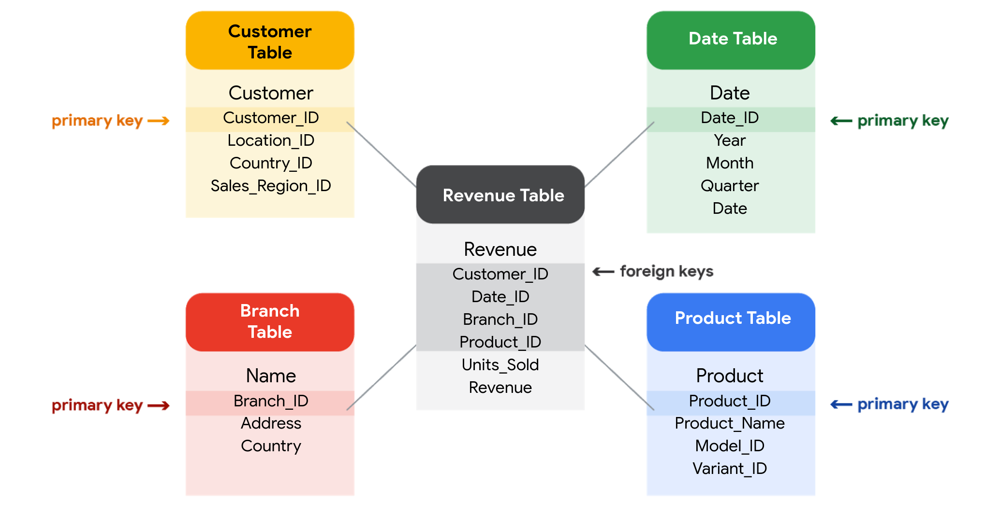

# Course 3: Prepare Data for Exploration

This course focuses on the 2nd phase of the data analysis process: **Prepare**. This course includes:
- How data is generated 
- Different formats, types, and structures of data
- Analyze data for bias and credibility
- What "clean data" means
- Databases
- Extract your own data using spreadsheets and SQL
- The basics of data organization
- The process of protecting data

----
## Module 1: Data types and structures

How data is created and how to decide which data to use for analysis. This module also covers structured and unstructured data, data types and data formats.

### Collecting data
- **How data is generated:**
    - **Every digital interaction**, from sending texts to watching videos, generates data.
    - **Traditional methods** like surveys and interviews also contribute to the generation of data.
- **How data is collected:**
    - Interviews
    - Observations
    - Forms
    - Questionnaires
    - Surveys
    - Cookies (small files stored on computers that contain information about users)

### Data collection considerations
- How the data will be collected
- Choose data sources:
    - First-party data: Data collected directly by an individual or group using their own resources
    - Second-party data: Data collected by a group directly from its audience and then sold (collected by another group and purchased)
    - Third-party data: Data collected from outside sources who did not collect it directly (obtained from various sources).
    - It's important to consider the reliability and trustworthiness of each source.
- Decide what data to use
- How much data to collect:
    - Sample: A part of a population that is representative of the population.
- Select the right data type

### Select the right data

Data colleection planning:
- **Source Identification:** Determine whether to gather data directly (first-party) or acquire it from second-party or third-party providers.
- **Relevance to the problem:** Select datasets that directly address your business problem, ensuring they contain the necessary information for analysis.

Data collection logistics:
- **Sample Size Determination:** If collecting your own data, decide on an appropriate sample size, considering whether a random sample or a more focused approach is suitable.
- **Time Frame Considerations:** Establish the data collection duration, especially for trend analysis. If time is limited, leverage existing historical data.

### Discover data formats
- **Quantitative & Qualitative Data**:
    - Quantitative data can be measured and expressed numerically (like a movie's budget), while qualitative data describes qualities and characteristics (like a movie's title).
    - Quantitative data can be further classified as discrete (countable, with a limited number of values, like box office revenue) or continuous (measurable on a continuous scale, like a movie's runtime).
- **Other data types**:
    - Nominal data is qualitative data without a set order (like "yes" or "no" responses), while ordinal data has a set order (like ranking a movie on a scale of 1 to 5).
    - Internal data comes from within an organization (like a movie studio's own data), while external data comes from outside sources.
    - Structured data is organized in a specific format (like in a spreadsheet), while unstructured data is not (like audio or video files).

### Structured data vs unstructured data
- Structured data is information organized neatly into rows and columns, making it easily understandable by computers.
- Structured data is easily searchable and ready for analysis, visualizations, and generating insights.
- Unstructured data has no established rule about how to compare two different pieces of data. On the other hand, structured data conforms to organizational rules.

### Data modeling
- **Data modeling** is the process of creating diagrams that visually represent how data is organized and structured.  These visual representations are called **data models**. 
- Levels of data modeling:
    - **Conceptual data modeling** gives a high-level view of the data structure without technical details, such as how data interacts across an organization. 
    - **Logical data modeling** focuses on the technical details of a database such as relationships, attributes, and entities.
    - **Physical data modeling** depicts how a database operates. A physical data model defines all entities and attributes used. 
    

### Data types
- A data type tells you what kind of information a piece of data represents, which influences how it can be used.
- Example: Number, Text/String, Boolean.

### Tables
- Data tables, also known as tabular data, are structured in a simple row and column format, similar to a playlist, calendar, or email inbox.
- In data analytics, rows are often referred to as "records" and columns as "fields," although the terms "rows" and "columns" are more common in spreadsheets.

### Wide Data and Long Data
- **Wide data:** Wide data represents each subject in a single row, with multiple columns holding different attributes or time points, making it suitable for comparing attributes across subjects.
- **Long data:** Long data uses multiple rows to represent different observations for each subject, with each row dedicated to a specific attribute or time point. This format is ideal for analyzing trends over time or comparing subjects across multiple variables.

### Transforming data
- **Data transformation** is the process of changing the data’s format, structure, or values. 
- Data transformation usually involves:
    - Adding, copying, or replicating data 
    - Deleting fields or records 
    - Standardizing the names of variables
    - Renaming, moving, or combining columns in a database
    - Joining one set of data with another
    - Saving a file in a different format. For example, saving a spreadsheet as a comma separated values (.csv) file.
- Goals for data transformation:
    - Data organization: better organized data is easier to use
    - Data compatibility: different applications or systems can then use the same data
    - Data migration: data with matching formats can be moved from one system to another
    - Data merging: data with the same organization can be merged together
    - Data enhancement: data can be displayed with more detailed fields 
    - Data comparison: apples-to-apples comparisons of the data can then be made 

----
## Module 2: Data responsibility
### Unbiased and objective data
- **Bias** is a preference for or against something, influenced by personal experiences and beliefs. It can be conscious or subconscious, impacting our judgments and decisions.
- In data analysis, bias can skew results and lead to inaccurate conclusions, with potentially serious consequences in fields like healthcare and business.
- **Data bias:** A type of error that systematically skews results in a certain direction.
- **Unbiased sampling:** When a sample is representative of the population being measured.

### Types of bias
- **Sampling bias:** When a sample isn't representative of the population as a whole.
- **Observer bias (experimenter bias/ research bias)**: when individuals perceive and interpret data differently based on their subjective viewpoints.
- **Interpretation bias:** The tendency to always interpret ambiguous situations in a positive or negetive way. Interpretation bias arises from personal experiences and backgrounds, leading to differing interpretations of the same data.
- **Confirmation bias:** The tendency to research for or interpret information in a way that confirms pre-existing beliefs while disregarding contradictory evidence.

### Identifying good data sources
- **ROCCC** stands for Reliable, Original, Comprehensive, Current, Cited.
- ROCCC are key characteristics of good data
- Bad data sources are not ROCCC.

### Data ethics and privacy
- **Data ethics:** Well-founded standards of right and wrong that dictate how data is collected, shared and used.
- Data ethics provides a framework for responsible data practices, ensuring fairness, transparency, and respect for individuals' data rights.

### Aspects of data ethics
- **Ownership**: Individuals own their data, not the organizations collecting it. They have rights over its usage, processing, and sharing.
- **Transaction Transparency**: All data processes and algorithms should be clear and understandable to the individual providing the data, addressing concerns about bias.
- **Consent**: Individuals have the right to know exactly how their data will be used before agreeing to provide it, ensuring they aren't unfairly targeted.
- **Currency**: Individuals should be aware of financial transactions resulting from the use of their personal data and the scale of these transactions.
- **Privacy:**
    - Privacy is a personal concept, and we all have the right to define and protect our own data.
    - Data privacy revolves around safeguarding an individual's information and activities during any data transaction, ensuring responsible access, use, and collection.
    - Data privacy is paramount because it builds trust between individuals and companies handling their data.
- **Openness**

### Data Anonymization
- Data anonymization is crucial for protecting individuals' sensitive information by removing or altering personally identifiable information (PII).
- Common methods include **blanking, hashing, and masking**, often using codes to represent or replace sensitive data.
- Examples of data typically anonymized include names, addresses, phone numbers, medical records, and financial information.

### Open data (Openness)
- Open data refers to the unrestricted access, use, and sharing of data while still adhering to ethical considerations like transparency, privacy, and consent.
- The benefits of open data include wider use of credible databases, enhanced scientific collaboration, research advancements, and improved decision-making in various fields.
- Standards of Open data:
    - Open data should be readily available for download, preferably in common, modifiable formats, ensuring accessibility for all.
    - It should be reusable and redistributable, allowing for combination with other datasets to generate valuable insights.
- One of the main challenges of open data is achieving interoperability, which is the ability of different data systems to seamlessly connect and share information.
- Benefits and Concerns:
    - Open data promotes scientific collaboration, research, and informed decision-making by providing wider access to reliable data.
    - However, it's crucial to safeguard individual privacy, especially when dealing with third-party data that can contain personally identifiable information (PII).

### Module Conclusion

----
## Module 3: Database essentials
### Databases
- A **database** is like a structured container for information stored on a computer, making it easy to retrieve specific data for analysis.
- Databases allow you to sort and filter data to focus on specific details, leading to insightful reports and better decision-making.

### Metadata: Data about Data
- Metadata provides crucial context about the data, explaining its origin, creation process, and what it represents.
- Think of metadata as a guidebook for the data, making it understandable and useful for analysis. It helps analysts understand the context and meaning of the data they're working with.
- Types of metadata:
    - Descriptive metadata: describes a piece of data and can be used to identify it at a later point in time, like the ISBN, author, and title of a book.
    - Structural metadata: indicates how a piece of data is organized and whether it is part of one (or more than one) data collection (like how many locations contain a certain data), such as the chapters and pages within a book.
    - Administrative metadata: indicates the technical details of a digital asset/data, like the file type, date, and time of creation for a photo.
- Data analysts use second-party and third-party data, and metadata helps verify the reliability and consistency of these external sources.
- **Metadata repositories** are specialized databases specifically created to store and manage metadata. 
- **Data Governance** ensures the proper management of data assets, covering aspects like security, privacy, and usability.
- **Metadata specialists** are key players in data governance. They organize, maintain, and standardize data, ensuring its quality and accessibility.

### Benefits of metadata:
- **Reliability**: Metadata helps ensure data accuracy, precision, relevance, and timeliness, leading to reliable analysis results.
- **Consistency**: Metadata promotes uniformity in data organization, classification, storage, and access, enabling easier identification of relationships and patterns.

### Database features and components
- Relational Database:
    - A database that contains a series of related tables that can be connected via their relationships
    - A relational database is structured with interconnected tables linked through shared fields, enabling efficient data management and analysis.
    - **Normalization** is a process of organizing data in a relational database. It is applied to eliminate data redundancy, increase data integrity, and reduce complexity in a database.
- Primary Key:
    - A primary key uniquely identifies each record within a table, ensuring data integrity and acting as a unique identifier.
    - It's essential that primary keys are unique, meaning no two rows can have the same value, and they cannot be null or blank.
- Foreign key: 
    - A field within a table that is a primary key in another table.
    - Foreign keys establish connections between tables by referencing the primary key of another table.
    - They allow for seamless data retrieval and analysis across multiple tables by linking related information.
- These keys are crucial for establishing relationships between tables in a relational database.
    

### Sort and filter data
- **Sorting data:**
    - Arranging data into a meaningful order to make it easier to understand, analyze, and visualize.
    - Sorting arranges data alphabetically or numerically, making it easier to understand.
- **Filtering data:**
    - Showing only the data that meets a specific criteria while hiding the rest.

### BigQuery
----
## Module 4: Organize and protect data
### Data Organization Best Practices:
- **Naming Conventions:** Consistent guidelines that describe the content, date, or version of a file in its name (Use clear, descriptive names for files and folders.). 
- **Foldering:** Group related files in folders and subfolders
- **Archiving older files**
- **Developing metadata**
- **Aligning with team**

### Data Organization Methods:
- **Chronological:** Organize data by date, like the invoice folders in the video, which are sorted by year.
- **Categorical:** Group data into categories, such as the main "Finances" folder with subfolders for "Budget," "Invoices," and "Payroll."

### Data Security

----
## Module 5: Engage in the data community